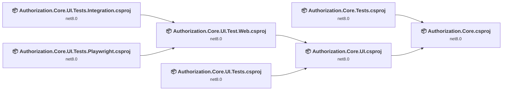
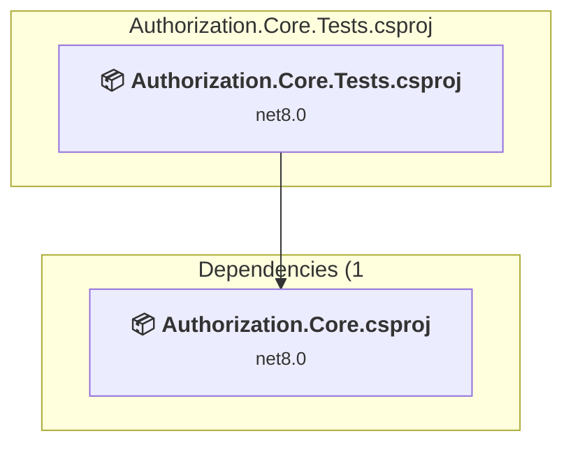
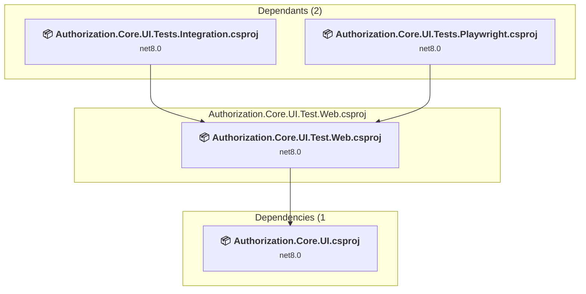
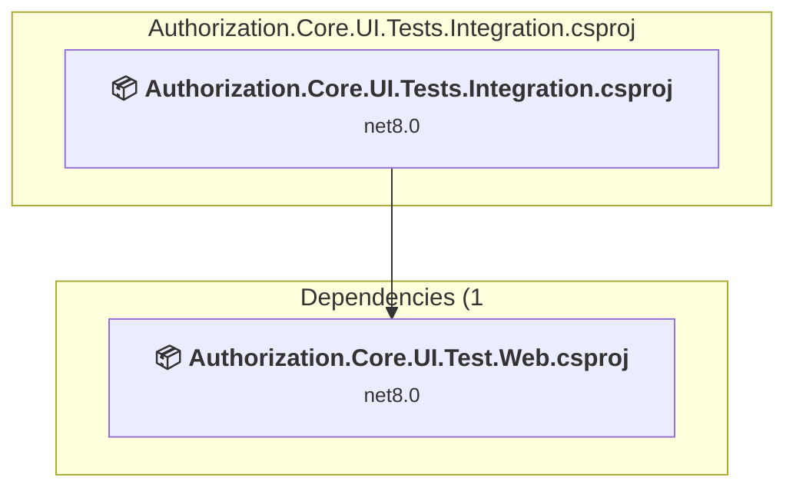
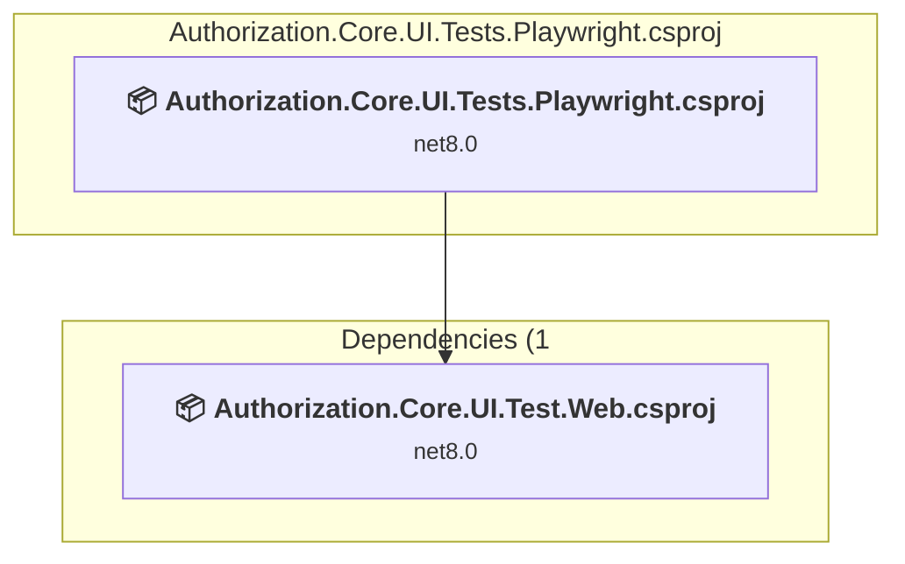
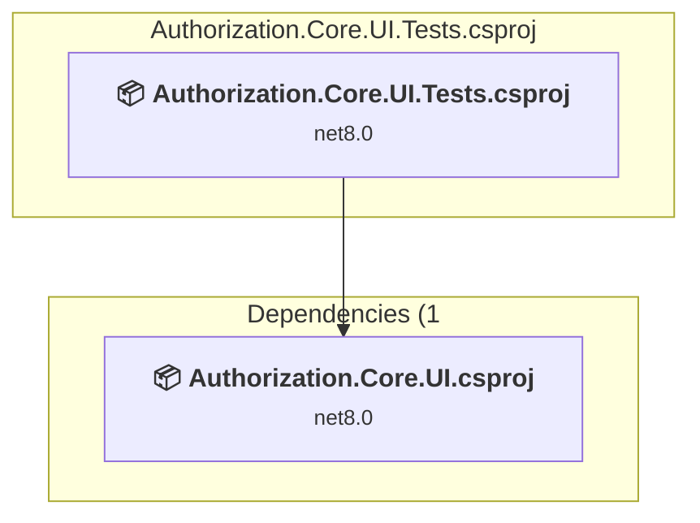
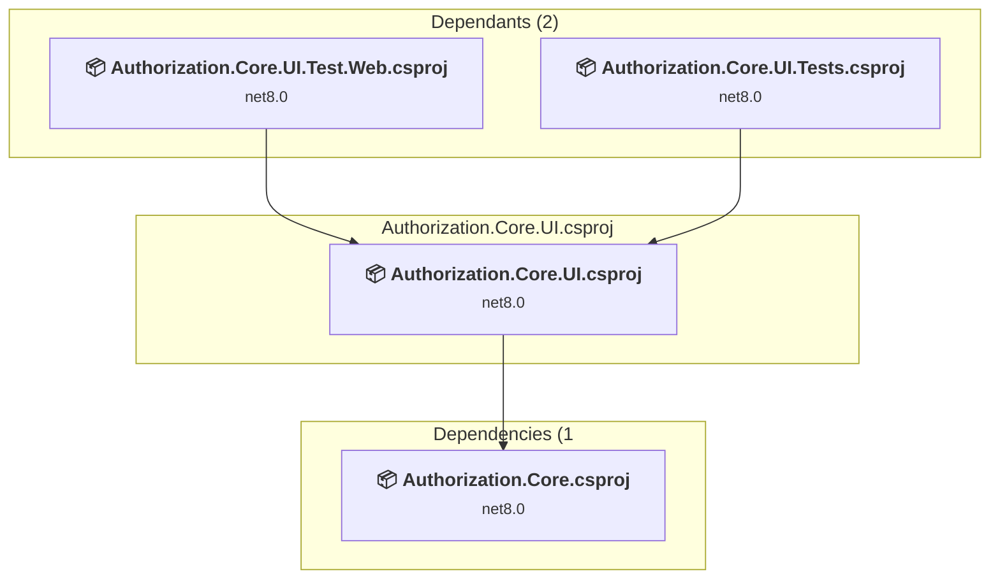
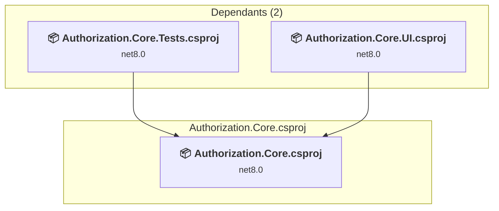

# Projects and dependencies analysis

This document provides a comprehensive overview of the projects and their dependencies in the context of upgrading to .NETCoreApp,Version=v9.0.

## Table of Contents

- [Executive Summary](#executive-Summary)
  - [Highlevel Metrics](#highlevel-metrics)
  - [Projects Compatibility](#projects-compatibility)
  - [Package Compatibility](#package-compatibility)
  - [API Compatibility](#api-compatibility)
- [Aggregate NuGet packages details](#aggregate-nuget-packages-details)
- [Top API Migration Challenges](#top-api-migration-challenges)
  - [Technologies and Features](#technologies-and-features)
  - [Most Frequent API Issues](#most-frequent-api-issues)
- [Projects Relationship Graph](#projects-relationship-graph)
- [Project Details](#project-details)

  - [Authorization.Core.Tests\Authorization.Core.Tests.csproj](#authorizationcoretestsauthorizationcoretestscsproj)
  - [Authorization.Core.UI.Test.Web\Authorization.Core.UI.Test.Web.csproj](#authorizationcoreuitestwebauthorizationcoreuitestwebcsproj)
  - [Authorization.Core.UI.Tests.Integration\Authorization.Core.UI.Tests.Integration.csproj](#authorizationcoreuitestsintegrationauthorizationcoreuitestsintegrationcsproj)
  - [Authorization.Core.UI.Tests.Playwright\Authorization.Core.UI.Tests.Playwright.csproj](#authorizationcoreuitestsplaywrightauthorizationcoreuitestsplaywrightcsproj)
  - [Authorization.Core.UI.Tests\Authorization.Core.UI.Tests.csproj](#authorizationcoreuitestsauthorizationcoreuitestscsproj)
  - [Authorization.Core.UI\Authorization.Core.UI.csproj](#authorizationcoreuiauthorizationcoreuicsproj)
  - [Authorization.Core\Authorization.Core.csproj](#authorizationcoreauthorizationcorecsproj)

## Executive Summary

### Highlevel Metrics

| Metric | Count | Status |
| :--- | :---: | :--- |
| Total Projects | 7 | All require upgrade |
| Total NuGet Packages | 22 | 8 need upgrade |
| Total Code Files | 129 |  |
| Total Code Files with Incidents | 10 |  |
| Total Lines of Code | 13615 |  |
| Total Number of Issues | 33 |  |
| Estimated LOC to modify | 13+ | at least 0.1% of codebase |

### Projects Compatibility

| Project | Target Framework | Difficulty | Package Issues | API Issues | Est. LOC Impact | Description |
| :--- | :---: | :---: | :---: | :---: | :---: | :--- |
| [Authorization.Core.Tests\Authorization.Core.Tests.csproj](#authorizationcoretestsauthorizationcoretestscsproj) | net8.0 | 🟢 Low | 1 | 0 |  | DotNetCoreApp, Sdk Style = True |
| [Authorization.Core.UI.Test.Web\Authorization.Core.UI.Test.Web.csproj](#authorizationcoreuitestwebauthorizationcoreuitestwebcsproj) | net8.0 | 🟢 Low | 5 | 9 | 9+ | AspNetCore, Sdk Style = True |
| [Authorization.Core.UI.Tests.Integration\Authorization.Core.UI.Tests.Integration.csproj](#authorizationcoreuitestsintegrationauthorizationcoreuitestsintegrationcsproj) | net8.0 | 🟢 Low | 2 | 0 |  | DotNetCoreApp, Sdk Style = True |
| [Authorization.Core.UI.Tests.Playwright\Authorization.Core.UI.Tests.Playwright.csproj](#authorizationcoreuitestsplaywrightauthorizationcoreuitestsplaywrightcsproj) | net8.0 | 🟢 Low | 1 | 0 |  | DotNetCoreApp, Sdk Style = True |
| [Authorization.Core.UI.Tests\Authorization.Core.UI.Tests.csproj](#authorizationcoreuitestsauthorizationcoreuitestscsproj) | net8.0 | 🟢 Low | 2 | 0 |  | DotNetCoreApp, Sdk Style = True |
| [Authorization.Core.UI\Authorization.Core.UI.csproj](#authorizationcoreuiauthorizationcoreuicsproj) | net8.0 | 🟢 Low | 1 | 2 | 2+ | ClassLibrary, Sdk Style = True |
| [Authorization.Core\Authorization.Core.csproj](#authorizationcoreauthorizationcorecsproj) | net8.0 | 🟢 Low | 1 | 2 | 2+ | ClassLibrary, Sdk Style = True |

### Package Compatibility

| Status | Count | Percentage |
| :--- | :---: | :---: |
| ✅ Compatible | 14 | 63.6% |
| ⚠️ Incompatible | 1 | 4.5% |
| 🔄 Upgrade Recommended | 7 | 31.8% |
| ***Total NuGet Packages*** | ***22*** | ***100%*** |

### API Compatibility

| Category | Count | Impact |
| :--- | :---: | :--- |
| 🔴 Binary Incompatible | 0 | High - Require code changes |
| 🟡 Source Incompatible | 13 | Medium - Needs re-compilation and potential conflicting API error fixing |
| 🔵 Behavioral change | 0 | Low - Behavioral changes that may require testing at runtime |
| ✅ Compatible | 54576 |  |
| ***Total APIs Analyzed*** | ***54589*** |  |

## Aggregate NuGet packages details

| Package | Current Version | Suggested Version | Projects | Description |
| :--- | :---: | :---: | :--- | :--- |
| coverlet.collector | 6.0.4 |  | [Authorization.Core.Tests.csproj](#authorizationcoretestsauthorizationcoretestscsproj) [Authorization.Core.UI.Tests.csproj](#authorizationcoreuitestsauthorizationcoreuitestscsproj) [Authorization.Core.UI.Tests.Integration.csproj](#authorizationcoreuitestsintegrationauthorizationcoreuitestsintegrationcsproj) [Authorization.Core.UI.Tests.Playwright.csproj](#authorizationcoreuitestsplaywrightauthorizationcoreuitestsplaywrightcsproj) | ✅Compatible |
| CRFricke.EF.Core.Utilities | 8.0.1 |  | [Authorization.Core.csproj](#authorizationcoreauthorizationcorecsproj) | ✅Compatible |
| CRFricke.Test.Support | 8.0.1 |  | [Authorization.Core.UI.Tests.csproj](#authorizationcoreuitestsauthorizationcoreuitestscsproj) | ✅Compatible |
| Microsoft.AspNetCore.Diagnostics.EntityFrameworkCore | 8.0.14 | 9.0.12 | [Authorization.Core.UI.Test.Web.csproj](#authorizationcoreuitestwebauthorizationcoreuitestwebcsproj) | NuGet package upgrade is recommended |
| Microsoft.AspNetCore.Identity.EntityFrameworkCore | 8.0.14 | 9.0.12 | [Authorization.Core.csproj](#authorizationcoreauthorizationcorecsproj) [Authorization.Core.UI.Test.Web.csproj](#authorizationcoreuitestwebauthorizationcoreuitestwebcsproj) | NuGet package upgrade is recommended |
| Microsoft.AspNetCore.Identity.UI | 8.0.14 | 9.0.12 | [Authorization.Core.UI.csproj](#authorizationcoreuiauthorizationcoreuicsproj) [Authorization.Core.UI.Test.Web.csproj](#authorizationcoreuitestwebauthorizationcoreuitestwebcsproj) | NuGet package upgrade is recommended |
| Microsoft.AspNetCore.Mvc.Testing | 8.0.14 | 9.0.12 | [Authorization.Core.UI.Tests.Integration.csproj](#authorizationcoreuitestsintegrationauthorizationcoreuitestsintegrationcsproj) [Authorization.Core.UI.Tests.Playwright.csproj](#authorizationcoreuitestsplaywrightauthorizationcoreuitestsplaywrightcsproj) | NuGet package upgrade is recommended |
| Microsoft.EntityFrameworkCore.Sqlite | 8.0.14 | 9.0.12 | [Authorization.Core.UI.Test.Web.csproj](#authorizationcoreuitestwebauthorizationcoreuitestwebcsproj) | NuGet package upgrade is recommended |
| Microsoft.EntityFrameworkCore.Tools | 8.0.14 | 9.0.12 | [Authorization.Core.UI.Test.Web.csproj](#authorizationcoreuitestwebauthorizationcoreuitestwebcsproj) | NuGet package upgrade is recommended |
| Microsoft.Extensions.Diagnostics.Testing | 8.10.0 |  | [Authorization.Core.Tests.csproj](#authorizationcoretestsauthorizationcoretestscsproj) [Authorization.Core.UI.Tests.csproj](#authorizationcoreuitestsauthorizationcoreuitestscsproj) | ✅Compatible |
| Microsoft.Extensions.Identity.Core | 8.0.14 | 9.0.12 | [Authorization.Core.UI.Tests.csproj](#authorizationcoreuitestsauthorizationcoreuitestscsproj) | NuGet package upgrade is recommended |
| Microsoft.NET.Test.Sdk | 17.13.0 |  | [Authorization.Core.Tests.csproj](#authorizationcoretestsauthorizationcoretestscsproj) [Authorization.Core.UI.Tests.csproj](#authorizationcoreuitestsauthorizationcoreuitestscsproj) [Authorization.Core.UI.Tests.Integration.csproj](#authorizationcoreuitestsintegrationauthorizationcoreuitestsintegrationcsproj) [Authorization.Core.UI.Tests.Playwright.csproj](#authorizationcoreuitestsplaywrightauthorizationcoreuitestsplaywrightcsproj) | ✅Compatible |
| Microsoft.Playwright.NUnit | 1.50.0 |  | [Authorization.Core.UI.Tests.Playwright.csproj](#authorizationcoreuitestsplaywrightauthorizationcoreuitestsplaywrightcsproj) | ✅Compatible |
| Microsoft.Playwright.TestAdapter | 1.50.0 |  | [Authorization.Core.UI.Tests.Integration.csproj](#authorizationcoreuitestsintegrationauthorizationcoreuitestsintegrationcsproj) | ✅Compatible |
| Microsoft.SourceLink.GitHub | 8.0.0 |  | [Authorization.Core.csproj](#authorizationcoreauthorizationcorecsproj) [Authorization.Core.UI.csproj](#authorizationcoreuiauthorizationcoreuicsproj) | ✅Compatible |
| MockQueryable.Moq | 7.0.3 |  | [Authorization.Core.Tests.csproj](#authorizationcoretestsauthorizationcoretestscsproj) [Authorization.Core.UI.Tests.csproj](#authorizationcoreuitestsauthorizationcoreuitestscsproj) | ✅Compatible |
| Moq | 4.20.72 |  | [Authorization.Core.UI.Tests.csproj](#authorizationcoreuitestsauthorizationcoreuitestscsproj) [Authorization.Core.UI.Tests.Integration.csproj](#authorizationcoreuitestsintegrationauthorizationcoreuitestsintegrationcsproj) | ✅Compatible |
| NUnit | 4.3.2 |  | [Authorization.Core.UI.Tests.Playwright.csproj](#authorizationcoreuitestsplaywrightauthorizationcoreuitestsplaywrightcsproj) | ✅Compatible |
| NUnit.Analyzers | 4.6.0 |  | [Authorization.Core.UI.Tests.Playwright.csproj](#authorizationcoreuitestsplaywrightauthorizationcoreuitestsplaywrightcsproj) | ✅Compatible |
| NUnit3TestAdapter | 5.0.0 |  | [Authorization.Core.UI.Tests.Playwright.csproj](#authorizationcoreuitestsplaywrightauthorizationcoreuitestsplaywrightcsproj) | ✅Compatible |
| xunit | 2.9.3 |  | [Authorization.Core.Tests.csproj](#authorizationcoretestsauthorizationcoretestscsproj) [Authorization.Core.UI.Tests.csproj](#authorizationcoreuitestsauthorizationcoreuitestscsproj) [Authorization.Core.UI.Tests.Integration.csproj](#authorizationcoreuitestsintegrationauthorizationcoreuitestsintegrationcsproj) | ⚠️NuGet package is deprecated |
| xunit.runner.visualstudio | 3.0.2 |  | [Authorization.Core.Tests.csproj](#authorizationcoretestsauthorizationcoretestscsproj) [Authorization.Core.UI.Tests.csproj](#authorizationcoreuitestsauthorizationcoreuitestscsproj) [Authorization.Core.UI.Tests.Integration.csproj](#authorizationcoreuitestsintegrationauthorizationcoreuitestsintegrationcsproj) | ✅Compatible |

## Top API Migration Challenges

### Technologies and Features

| Technology | Issues | Percentage | Migration Path |
| :--- | :---: | :---: | :--- |

### Most Frequent API Issues

| API | Count | Percentage | Category |
| :--- | :---: | :---: | :--- |
| M:System.TimeSpan.FromMinutes(System.Double) | 3 | 23.1% | Source Incompatible |
| P:Microsoft.AspNetCore.Identity.UI.UIFrameworkAttribute.UIFramework | 1 | 7.7% | Source Incompatible |
| T:Microsoft.AspNetCore.Identity.UI.UIFrameworkAttribute | 1 | 7.7% | Source Incompatible |
| T:Microsoft.AspNetCore.Builder.MigrationsEndPointExtensions | 1 | 7.7% | Source Incompatible |
| M:Microsoft.AspNetCore.Builder.MigrationsEndPointExtensions.UseMigrationsEndPoint(Microsoft.AspNetCore.Builder.IApplicationBuilder) | 1 | 7.7% | Source Incompatible |
| T:Microsoft.Extensions.DependencyInjection.IdentityServiceCollectionUIExtensions | 1 | 7.7% | Source Incompatible |
| M:Microsoft.Extensions.DependencyInjection.IdentityServiceCollectionUIExtensions.AddDefaultIdentity''1(Microsoft.Extensions.DependencyInjection.IServiceCollection,System.Action{Microsoft.AspNetCore.Identity.IdentityOptions}) | 1 | 7.7% | Source Incompatible |
| T:Microsoft.Extensions.DependencyInjection.IdentityEntityFrameworkBuilderExtensions | 1 | 7.7% | Source Incompatible |
| M:Microsoft.Extensions.DependencyInjection.IdentityEntityFrameworkBuilderExtensions.AddEntityFrameworkStores''1(Microsoft.AspNetCore.Identity.IdentityBuilder) | 1 | 7.7% | Source Incompatible |
| T:Microsoft.Extensions.DependencyInjection.DatabaseDeveloperPageExceptionFilterServiceExtensions | 1 | 7.7% | Source Incompatible |
| M:Microsoft.Extensions.DependencyInjection.DatabaseDeveloperPageExceptionFilterServiceExtensions.AddDatabaseDeveloperPageExceptionFilter(Microsoft.Extensions.DependencyInjection.IServiceCollection) | 1 | 7.7% | Source Incompatible |

## Projects Relationship Graph

Legend:
📦 SDK-style project
⚙️ Classic project

## Project Details

### Authorization.Core.Tests\Authorization.Core.Tests.csproj

#### Project Info

- **Current Target Framework:** net8.0
- **Proposed Target Framework:** net9.0
- **SDK-style**: True
- **Project Kind:** DotNetCoreApp
- **Dependencies**: 1
- **Dependants**: 0
- **Number of Files**: 7
- **Number of Files with Incidents**: 1
- **Lines of Code**: 1105
- **Estimated LOC to modify**: 0+ (at least 0.0% of the project)

#### Dependency Graph

Legend:
📦 SDK-style project
⚙️ Classic project

### API Compatibility

| Category | Count | Impact |
| :--- | :---: | :--- |
| 🔴 Binary Incompatible | 0 | High - Require code changes |
| 🟡 Source Incompatible | 0 | Medium - Needs re-compilation and potential conflicting API error fixing |
| 🔵 Behavioral change | 0 | Low - Behavioral changes that may require testing at runtime |
| ✅ Compatible | 2701 |  |
| ***Total APIs Analyzed*** | ***2701*** |  |

### Authorization.Core.UI.Test.Web\Authorization.Core.UI.Test.Web.csproj

#### Project Info

- **Current Target Framework:** net8.0
- **Proposed Target Framework:** net9.0
- **SDK-style**: True
- **Project Kind:** AspNetCore
- **Dependencies**: 1
- **Dependants**: 2
- **Number of Files**: 69
- **Number of Files with Incidents**: 2
- **Lines of Code**: 1993
- **Estimated LOC to modify**: 9+ (at least 0.5% of the project)

#### Dependency Graph

Legend:
📦 SDK-style project
⚙️ Classic project

### API Compatibility

| Category | Count | Impact |
| :--- | :---: | :--- |
| 🔴 Binary Incompatible | 0 | High - Require code changes |
| 🟡 Source Incompatible | 9 | Medium - Needs re-compilation and potential conflicting API error fixing |
| 🔵 Behavioral change | 0 | Low - Behavioral changes that may require testing at runtime |
| ✅ Compatible | 6015 |  |
| ***Total APIs Analyzed*** | ***6024*** |  |

### Authorization.Core.UI.Tests.Integration\Authorization.Core.UI.Tests.Integration.csproj

#### Project Info

- **Current Target Framework:** net8.0
- **Proposed Target Framework:** net9.0
- **SDK-style**: True
- **Project Kind:** DotNetCoreApp
- **Dependencies**: 1
- **Dependants**: 0
- **Number of Files**: 5
- **Number of Files with Incidents**: 1
- **Lines of Code**: 325
- **Estimated LOC to modify**: 0+ (at least 0.0% of the project)

#### Dependency Graph

Legend:
📦 SDK-style project
⚙️ Classic project

### API Compatibility

| Category | Count | Impact |
| :--- | :---: | :--- |
| 🔴 Binary Incompatible | 0 | High - Require code changes |
| 🟡 Source Incompatible | 0 | Medium - Needs re-compilation and potential conflicting API error fixing |
| 🔵 Behavioral change | 0 | Low - Behavioral changes that may require testing at runtime |
| ✅ Compatible | 474 |  |
| ***Total APIs Analyzed*** | ***474*** |  |

### Authorization.Core.UI.Tests.Playwright\Authorization.Core.UI.Tests.Playwright.csproj

#### Project Info

- **Current Target Framework:** net8.0
- **Proposed Target Framework:** net9.0
- **SDK-style**: True
- **Project Kind:** DotNetCoreApp
- **Dependencies**: 1
- **Dependants**: 0
- **Number of Files**: 7
- **Number of Files with Incidents**: 1
- **Lines of Code**: 1374
- **Estimated LOC to modify**: 0+ (at least 0.0% of the project)

#### Dependency Graph

Legend:
📦 SDK-style project
⚙️ Classic project

### API Compatibility

| Category | Count | Impact |
| :--- | :---: | :--- |
| 🔴 Binary Incompatible | 0 | High - Require code changes |
| 🟡 Source Incompatible | 0 | Medium - Needs re-compilation and potential conflicting API error fixing |
| 🔵 Behavioral change | 0 | Low - Behavioral changes that may require testing at runtime |
| ✅ Compatible | 3491 |  |
| ***Total APIs Analyzed*** | ***3491*** |  |

### Authorization.Core.UI.Tests\Authorization.Core.UI.Tests.csproj

#### Project Info

- **Current Target Framework:** net8.0
- **Proposed Target Framework:** net9.0
- **SDK-style**: True
- **Project Kind:** DotNetCoreApp
- **Dependencies**: 1
- **Dependants**: 0
- **Number of Files**: 8
- **Number of Files with Incidents**: 1
- **Lines of Code**: 3007
- **Estimated LOC to modify**: 0+ (at least 0.0% of the project)

#### Dependency Graph

Legend:
📦 SDK-style project
⚙️ Classic project

### API Compatibility

| Category | Count | Impact |
| :--- | :---: | :--- |
| 🔴 Binary Incompatible | 0 | High - Require code changes |
| 🟡 Source Incompatible | 0 | Medium - Needs re-compilation and potential conflicting API error fixing |
| 🔵 Behavioral change | 0 | Low - Behavioral changes that may require testing at runtime |
| ✅ Compatible | 8868 |  |
| ***Total APIs Analyzed*** | ***8868*** |  |

### Authorization.Core.UI\Authorization.Core.UI.csproj

#### Project Info

- **Current Target Framework:** net8.0
- **Proposed Target Framework:** net9.0
- **SDK-style**: True
- **Project Kind:** ClassLibrary
- **Dependencies**: 1
- **Dependants**: 2
- **Number of Files**: 45
- **Number of Files with Incidents**: 2
- **Lines of Code**: 3716
- **Estimated LOC to modify**: 2+ (at least 0.1% of the project)

#### Dependency Graph

Legend:
📦 SDK-style project
⚙️ Classic project

### API Compatibility

| Category | Count | Impact |
| :--- | :---: | :--- |
| 🔴 Binary Incompatible | 0 | High - Require code changes |
| 🟡 Source Incompatible | 2 | Medium - Needs re-compilation and potential conflicting API error fixing |
| 🔵 Behavioral change | 0 | Low - Behavioral changes that may require testing at runtime |
| ✅ Compatible | 30986 |  |
| ***Total APIs Analyzed*** | ***30988*** |  |

### Authorization.Core\Authorization.Core.csproj

#### Project Info

- **Current Target Framework:** net8.0
- **Proposed Target Framework:** net9.0
- **SDK-style**: True
- **Project Kind:** ClassLibrary
- **Dependencies**: 0
- **Dependants**: 2
- **Number of Files**: 30
- **Number of Files with Incidents**: 2
- **Lines of Code**: 2095
- **Estimated LOC to modify**: 2+ (at least 0.1% of the project)

#### Dependency Graph

Legend:
📦 SDK-style project
⚙️ Classic project

### API Compatibility

| Category | Count | Impact |
| :--- | :---: | :--- |
| 🔴 Binary Incompatible | 0 | High - Require code changes |
| 🟡 Source Incompatible | 2 | Medium - Needs re-compilation and potential conflicting API error fixing |
| 🔵 Behavioral change | 0 | Low - Behavioral changes that may require testing at runtime |
| ✅ Compatible | 2041 |  |
| ***Total APIs Analyzed*** | ***2043*** |  |

