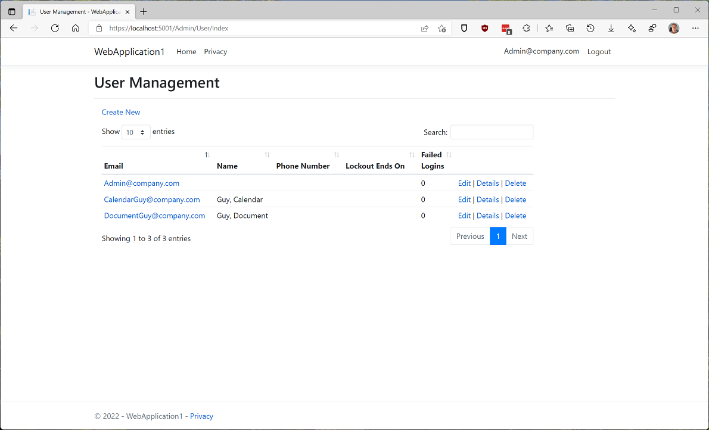
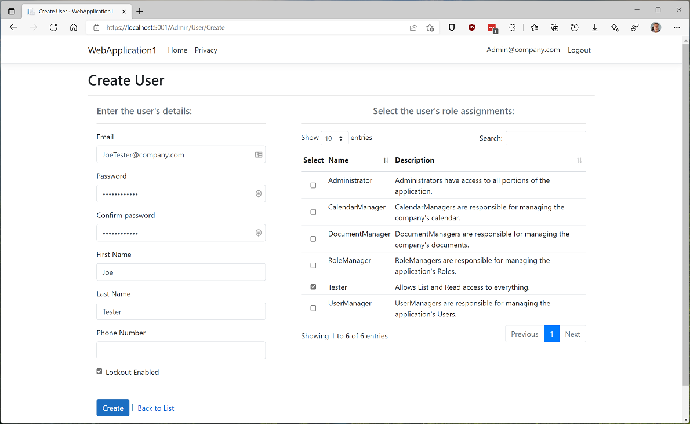
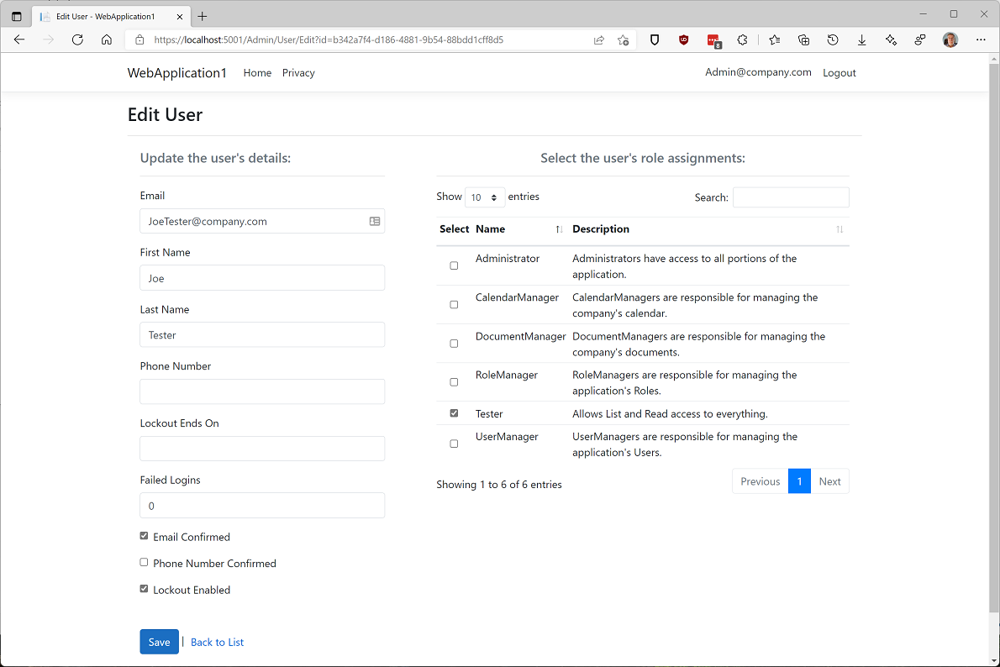
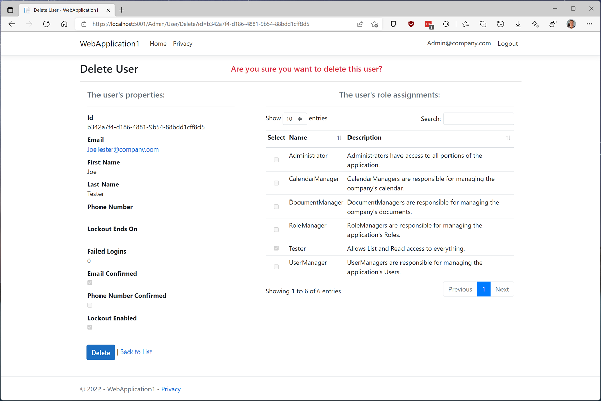

# User Management Pages

The Authorization.Core.UI package provides a user interface for managing your application's Users.
Each User can be assigned one or more Roles that control what that user can do.

## User Management Page

The User Management page is the landing page for all User management functions.

The default Area for the page is `Authorization`, however it can be changed by specifying a different 
value for the `options.FriendlyAreaName` property of the `AddAuthorizationCoreUI` clause 
as described in [Update Startup.cs](Install-UI-Package.md#update-startupcs-programcs-in-net-60).

Our sample web application specifies "Admin" for FriendlyAreaName. As a result, the application's User 
Management page is located at `https://localhost:5001/Admin/User` (as seen in the screen capture 
below).

The following links are available on this page:

  |**Link**|**Action**|
  |---|---|
  |Create New| Displays the Create User page which is used to configure a new User.|
  |Edit|Displays the Edit User page which is used to edit the associated User.|
  |Details|Displays the User Details page which is used to view the details of the associated User.|
  |Delete|Displays the Delete User page which can be used to delete the associated User.|

&nbsp;

## Create User Page

The Create User page is used to configure a new User.
You enter the user's personal information, and select one or more Roles for the User.
The Search text box can be used to filter the displayed claims.

Click the `Create` button to save the User, or `Back to List` to cancel the operation.

&nbsp;

## Edit User Page

The Edit User page is used to make changes to a User. You can change the User's personal information.
When editing a system User (like "Administrator"), the list of Roles will be disabled;
otherwise, the assigned Roles can also be changed.

When your changes are complete, click `Save` to save the User, or `Back to List` to cancel the operation.

&nbsp;

## User Details Page

The User Details page is used to view a User's configuration.
The page displays the User's personal information and Role assignments.

When done, click `Edit` to go to the Edit User page, or `Back to List` to return to the User 
Management page.

&nbsp;

## Delete User Page

The Delete User page is used to delete the selected User. In addition to the User's personal information,  
the page lists any Roles that are assigned to the User.

The page will not allow a system User to be deleted (a warning message is displayed and the Delete button 
is disabled).

Click `Delete` to delete the User, or `Back to List` to cancel the operation.

&nbsp;  

